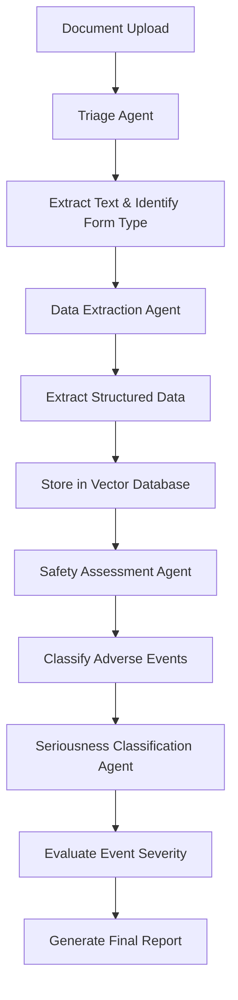

# 🤖 Multi-Agent Document Processor for Pharmacovigilance

A sophisticated AI-powered document processing system that uses multiple specialized agents to analyze medical safety reports, extract structured data, and classify adverse events. Built with CrewAI, Streamlit, and OpenAI GPT-4.

## 🚀 Features

### 🤖 **Four Specialized AI Agents**

1. **📋 Medical Form Triage Specialist**
   - Identifies document type (MedWatch, CIOMS, E2B)
   - Loads and extracts text from PDF/TXT documents
   - Routes documents to appropriate processing pipeline

2. **🔍 Data Extraction Specialist**
   - Extracts structured medical data from documents
   - Identifies patient information, drug names, adverse events
   - Stores data in AstraDB vector database for future retrieval

3. **⚠️ Safety Assessment Specialist**
   - Classifies whether events are adverse events
   - Uses medical knowledge to assess safety concerns
   - Provides binary classification (Yes/No) with reasoning

4. **🏥 Seriousness Classification Specialist**
   - Evaluates severity of adverse events
   - Classifies based on standard criteria:
     - Death
     - Life-Threatening
     - Hospitalization
     - Disability
     - Congenital Anomaly

### 🛠️ **Technical Capabilities**

- **📄 Document Processing**: PDF and TXT file support
- **🧠 AI-Powered Analysis**: OpenAI GPT-4 integration
- **💾 Vector Storage**: AstraDB integration with fallback
- **🌐 Web Interface**: Streamlit-based user interface
- **🔄 Agent Orchestration**: CrewAI framework for workflow management
- **📊 Real-time Processing**: Live progress tracking and status updates

## 🏗️ Architecture

```
┌─────────────────┐    ┌──────────────────┐    ┌─────────────────┐
│   Streamlit     │    │   CrewAI         │    │   OpenAI        │
│   Web Interface │◄──►│   Orchestrator   │◄──►│   GPT-4         │
└─────────────────┘    └──────────────────┘    └─────────────────┘
         │                       │                       │
         │                       │                       │
         ▼                       ▼                       ▼
┌─────────────────┐    ┌──────────────────┐    ┌─────────────────┐
│   File Upload   │    │   AI Agents      │    │   AstraDB       │
│   & Processing  │    │   Workflow       │    │   Vector Store  │
└─────────────────┘    └──────────────────┘    └─────────────────┘
```

## 🚀 Quick Start

### Prerequisites

- Python 3.8+
- OpenAI API Key
- (Optional) AstraDB credentials for vector storage

### Installation

1. **Clone the repository**
   ```bash
   git clone https://github.com/prakharsinghpersonal/multi-agent-document-processor.git
   cd multi-agent-document-processor
   ```

2. **Create virtual environment**
   ```bash
   python -m venv cognivigilance_env
   source cognivigilance_env/bin/activate  # On Windows: cognivigilance_env\Scripts\activate
   ```

3. **Install dependencies**
   ```bash
   pip install -r requirements.txt
   ```

4. **Set up environment variables**
   ```bash
   # Create .env file with your API keys
   OPENAI_API_KEY=your_openai_api_key_here
   GEMINI_API_KEY=your_gemini_api_key_here
   
   # Optional: AstraDB credentials
   ASTRA_DB_API_ENDPOINT=your_astra_endpoint
   ASTRA_DB_APPLICATION_TOKEN=your_astra_token
   ```

5. **Run the application**
   ```bash
   streamlit run app.py
   ```

6. **Access the application**
   - Open your browser to `http://localhost:8501`
   - Upload a medical document (PDF or TXT)
   - Click "Begin Processing" to start the AI agent workflow

## 📁 Project Structure

```
multi-agent-document-processor/
├── app.py                 # Streamlit web application
├── agents.py             # AI agent definitions
├── tasks.py              # Task configurations
├── tools.py              # Custom tools for document processing
├── logger_config.py      # Logging configuration
├── requirements.txt      # Python dependencies
├── .env                  # Environment variables (create this)
├── README.md            # This file
├── logs/                # Application logs
└── pdf/                 # Sample documents
```

## 🔧 Configuration

### Environment Variables

Create a `.env` file in the project root:

```env
# Required
OPENAI_API_KEY=your_openai_api_key_here

# Optional
GEMINI_API_KEY=your_gemini_api_key_here
ASTRA_DB_API_ENDPOINT=your_astra_endpoint
ASTRA_DB_APPLICATION_TOKEN=your_astra_token
```

### AstraDB Setup (Optional)

For vector storage capabilities:

1. Create an AstraDB account at [datastax.com](https://datastax.com)
2. Create a new database
3. Get your API endpoint and application token
4. Add credentials to your `.env` file

*Note: The system works without AstraDB using a mock store for testing.*

## 🎯 Use Cases

### Pharmacovigilance
- **Medical Safety Reports**: Process FDA MedWatch forms
- **Adverse Event Analysis**: Classify and assess drug safety events
- **Clinical Data Extraction**: Extract structured data from medical documents

### Healthcare Analytics
- **Document Classification**: Automatically categorize medical forms
- **Data Standardization**: Convert unstructured text to structured data
- **Risk Assessment**: Evaluate severity of medical events

### Research & Development
- **Clinical Trial Data**: Process safety reports from trials
- **Literature Analysis**: Extract insights from medical literature
- **Compliance Monitoring**: Ensure regulatory compliance

## 🤖 AI Agent Workflow



## 📊 Performance

- **Processing Time**: 2-5 minutes per document
- **Accuracy**: High accuracy for structured medical documents
- **Scalability**: Handles multiple document types
- **Reliability**: Robust error handling and fallback mechanisms

## 🔒 Security

- **API Key Protection**: All credentials stored in `.env` file
- **Data Privacy**: No data stored permanently without consent
- **Secure Processing**: Temporary file handling with automatic cleanup
- **Rate Limiting**: Built-in OpenAI rate limit handling

## 🛠️ Development

### Adding New Agents

1. Define agent in `agents.py`
2. Create corresponding task in `tasks.py`
3. Add custom tools in `tools.py`
4. Update the crew configuration in `app.py`

### Custom Tools

Create new tools by extending the `BaseTool` class:

```python
from crewai.tools import BaseTool

class CustomTool(BaseTool):
    name: str = "Custom Tool Name"
    description: str = "Tool description"
    
    def _run(self, input_param: str) -> str:
        # Your tool logic here
        return result
```

## 📈 Monitoring & Logging

- **Real-time Logs**: Check `logs/` directory for detailed execution logs
- **Agent Performance**: Monitor individual agent execution times
- **Error Tracking**: Comprehensive error logging and handling
- **Progress Updates**: Live status updates in the web interface

## 🤝 Contributing

1. Fork the repository
2. Create a feature branch (`git checkout -b feature/amazing-feature`)
3. Commit your changes (`git commit -m 'Add amazing feature'`)
4. Push to the branch (`git push origin feature/amazing-feature`)
5. Open a Pull Request

## 📄 License

This project is licensed under the MIT License - see the [LICENSE](LICENSE) file for details.

## 🆘 Support

### Common Issues

1. **Import Errors**: Ensure all dependencies are installed
2. **API Rate Limits**: Check your OpenAI API usage and limits
3. **File Upload Issues**: Verify file format (PDF/TXT only)
4. **Memory Issues**: Large documents may require more memory

### Getting Help

- **Issues**: Create an issue on GitHub
- **Documentation**: Check the logs in `logs/` directory
- **Community**: Join our discussions for support

## 🎉 Acknowledgments

- **CrewAI**: For the multi-agent framework
- **Streamlit**: For the web interface
- **OpenAI**: For the GPT-4 language model
- **LangChain**: For tool integration
- **AstraDB**: For vector storage capabilities

---

**Built with ❤️ for the future of medical document processing**

*Transform your medical document workflow with the power of AI agents!*